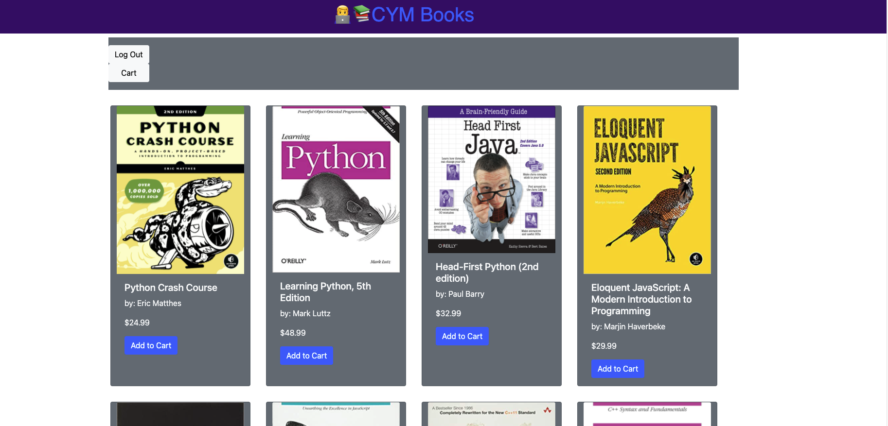

# CYM Books  - Project 2 Assignment
### by: Can Phan, Malachi Chapman, & Yonas Woldemichael
_

## Project 2
In Project 2 we were assigned the task of building a full-stack web application using the MVC paradigm, requiring that we create our own serverside API, connect to a database, and to also add user authentication.
_

## Table of Contents
 - [Description](#description)
 - [Installation](#installation)
 - [Visuals](#visuals)
 - [Links to Site](#Links_to_Site)
 - [Contributors](#Contributors)

 ## Description
CYM Books is an eccommerce webiste that allows you to shop around a list of various software developer books. Categories are divided by languages at the moment, and provides the client up to 3 options to choose from: Python, Javascript & C++. The books are all priced and display they author of the book as well.

 ## Apps Used
- Handlebars.js
- Node.js & Express.js
- MySQL & Sequelize ORM
- Both GET and POSt routs were used for retrieving data,
- MVC folder structure
- Authentiction (express-session & cookies)
- Anime.js

 ## Visuals

Here is an image of the homepage.

_

# Links to Site
To view the latest changes to the CYM Books application and get the lates work, please visit the link below.

- [CYM Books Repository](https://github.com/mchapm17/book-store)
- [Deployed Heroku Site](https://intense-tor-51749.herokuapp.com/)

# Contributors

 Malachi Chapman
 - [Github](https://github.com/mchapm17)

 Can Pham
 - [Github](https://github.com/CanTPhan)

Yonas Woldemichael
- [Github](https://github.com/Ybyonas1)